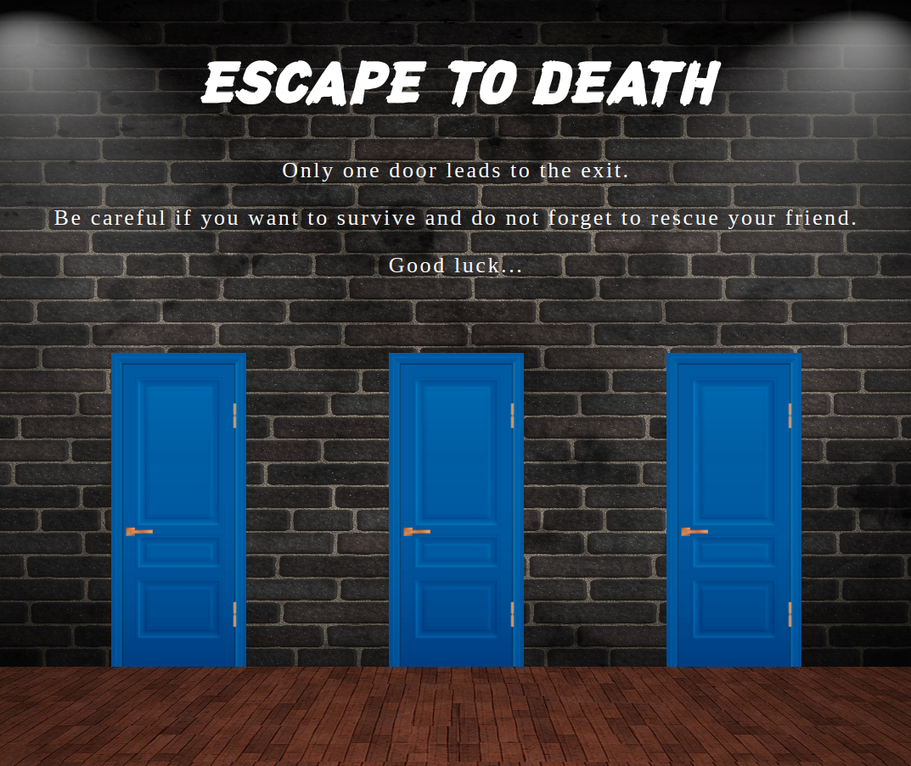

## ESCAPE TO DEATH

<p align="center">
  
</p>

Escape to death is a horror escape game where you and your friend have been kidnapped. The goal is to rescue your friend and scape both together. Be careful with the killer!

### **Features**


### **Setup**
---
If you’d like to view my project in your browser:

- Clone the repository in your computer, you can type the following command in your terminal
```bash
git clone https://github.com/diana-moreno/escape-to-death.git
```
- Open data-structure's folder.
- Open index.html
- Otherside, you can run the project here: https://diana-moreno.github.io/escape-to-death/


### **What I learned**


### **Resources**

- The images are from [freepik](https://www.freepik.es/).
- The sounds are Royalty Free of public domain, from [soundbible] (http://soundbible.com/royalty-free-sounds-1.html)
