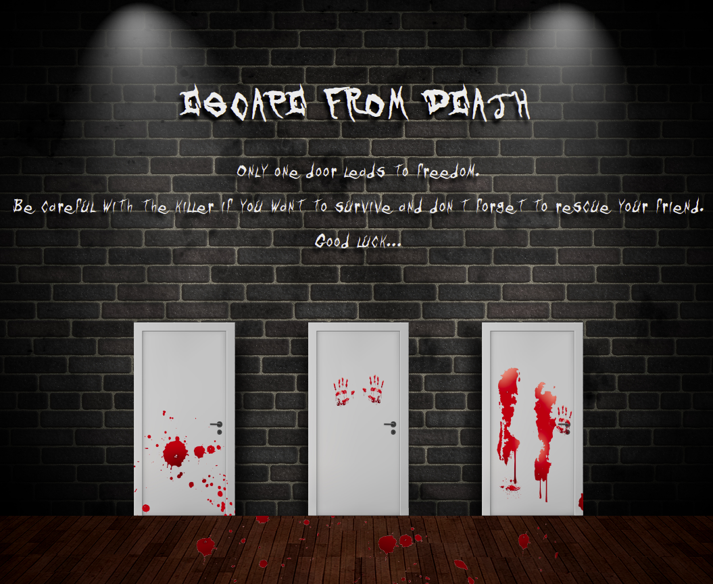

## ESCAPE FROM DEATH

<p align="center">
  
</p>

Escape from death is a horror escape game where you and your friend have been kidnapped. The goal is to rescue your friend and scape both together. Be careful with the killer!

### **Features**

- There are three closed doors: in one is your friend isolated, in other the killer, and in the other, the exit.
- If you find the exit, you won't be able to leave without your friend, you must rescue him first to leave together.
- If while trying to find the exit or your friend, you bump with the killer, the game is over.

### **Setup**
---
If you’d like to view my project in your browser:

- Clone the repository in your computer, you can type the following command in your terminal
```bash
git clone https://github.com/diana-moreno/escape-from-death.git
```
- Open data-structure's folder.
- Open index.html
- Otherside, you can run the project here: https://diana-moreno.github.io/escape-from-death/


### **What I learned**

- Create layout with basic CSS.
- Manipulate images with Gimp.
- Implement conditional javascript logic.
- Acces and manipulate the DOM.
- Add sounds in events DOM without need a server.

### **Resources**

- The images are from [freepik](https://www.freepik.es/).
- The sounds are Royalty Free of public domain, from [soundbible](http://soundbible.com/royalty-free-sounds-1.html)
